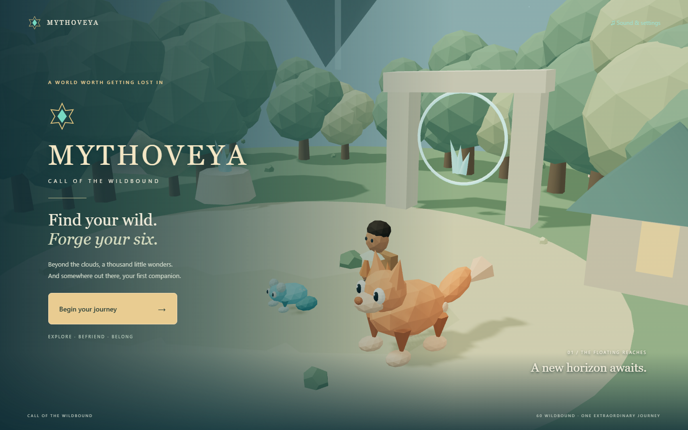
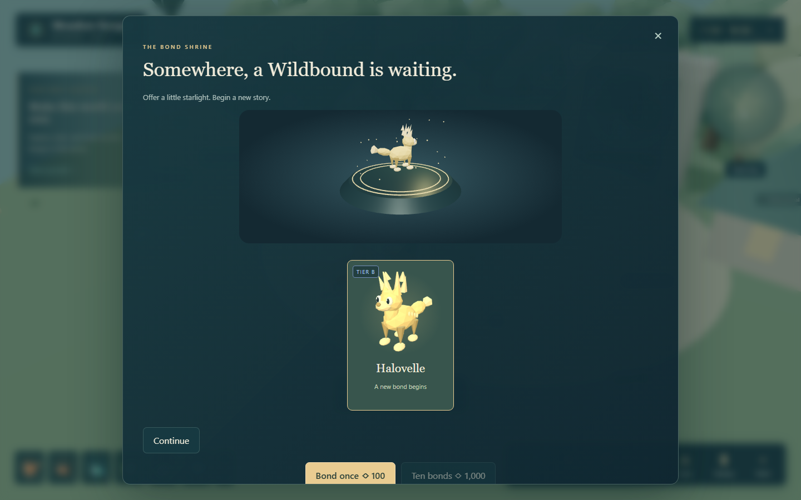
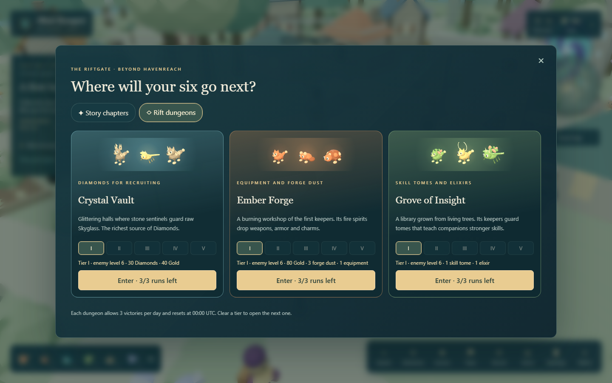
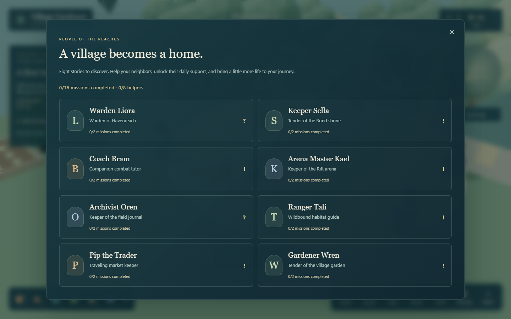

# Mythoveya: Call of the Wildbound

**Find your wild. Forge your six.**



Become a Riftkeeper in a world of floating islands, forgotten waystones, and extraordinary companions. Begin in Havenreach, choose the creature that speaks to you, and build a team of six Wildbound. Explore the reaches, discover new species, face their guardians, and challenge another keeper in the Rift Arena.

Mythoveya is a locally playable, browser-based 3D creature-collection RPG. Its world, characters, portraits, music, and effects are created from assets and recipes included in this project. Once installed, it plays without third-party asset downloads or an online service.

## The game

- **60 Wildbound:** ten species in each rarity from E to S, eight elements, twelve body families, 180 actions, and 60 passives.
- **Eight keepers:** choose a recognizable character and change your appearance later without losing progress.
- **Eight village friends:** meet Liora, Sella, Bram, Kael, Oren, Tali, Pip, and Wren. Explore 24 conversation topics, complete 16 missions, and unlock their daily help.
- **Make yourself at home:** trade supplies at Pip's rotating market, grow Sunseed, craft treats, nurture friendship, name companions, and dress your following friend with a ribbon or bell.
- **Your own six:** three front slots and three rear slots, with drag-and-drop or click-to-place formation editing.
- **Know where to go:** a chapter tracker, objective distance, and matching gold waypoints in the world and minimap guide your first journey. Nearby labels stay readable, while resource sparkles keep the scenery clear.
- **Explore on a smaller screen:** the quest tracker, map, wallet, team strip, and complete menu adapt to narrow screens. Drag the movement joystick, tap the ground or an object, or tap the nearby action button.
- **Four destinations:** Havenreach, Whisperleaf Meadow, Emberglass Canyon, and Moonfrost Hollow, with resources, roaming encounters, and enhanced region guardians.
- **A broader place to begin:** Havenreach has a connected village, orchard, grove, ruins, lookout, pond, and flower clearing. Follow the trails through woodland, cross the bridge, watch 17 additional roaming Wildbound, and gather from nine Sunseed sites.
- **Six welcoming homes:** visit the bakery, workshop, glasshouse, orchard cottage, ranger lodge, and woodland refuge. Sign each porch visitor book for Gold and XP; collect all six stamps for 50 Diamonds. Your book survives reloads.
- **Your own walking route:** choose a destination on the illustrated local map, follow its gold waypoint, sprint along the trails, and return to the village from the pause menu.
- **Point and click:** click the ground to walk there along the trails, or click a villager, home, crystal, or cache and your keeper walks over and interacts. Hover anything clickable for a ring and a short tooltip.
- **A living village:** timber cottages, a windmill, a well, lamp-lit trails, festival bunting, chimney smoke, drifting clouds, birds, and six islanders who stroll the paths by day and go home at night.
- **Day and night:** an 18-minute island day with dawn, dusk, moonlight, glowing windows and lamps, a crackling campfire, and fireflies. It can be turned off in settings.
- **Treasure and fishing:** find eight hidden Skyglass caches using clues on the map, and fish from the Willowmere dock in a timing mini-game. Pip buys your catch.
- **The Riftgate:** eight story chapters with thirty-two stages and a boss at the end of each, four daily dungeons (the Crystal Vault for Diamonds, the Ember Forge for equipment, the Grove of Insight for skill tomes, and the Tidal Grotto for Gold and Rift crystals), and the sixty-floor Rift Tower.
- **Grow every companion:** level skills and ultimates to 5, equip a weapon, armor, and charm, forge them up to +10, and use growth elixirs.
- **Tactical battles:** elemental advantages, energy, cooldowns, shields, healing, status effects, delayed attacks, revivals, and a visible turn queue. Manual and automatic controls are available in PvE.
- **A growing collection:** recruit with earned diamonds, bond with wild creatures, train companions, collect shards, and claim story and daily rewards.
- **Meet each new bond:** watch your recruited Wildbound arrive on the 3D shrine stage, and select any result from a ten-bond reveal to meet it up close.
- **Human arena battles:** friendly room codes and ranked matchmaking, separate Power and Tactical ratings, authoritative turns, and reconnect support.
- **A living presentation:** articulated creatures and keepers, model-rendered portraits, eight synthesized music arrangements, elemental effects, species voices, and ten mythic ultimate recipes.
- **Saved adventures:** SQLite stores profiles, formations, inventory, currency, pity counters, quests, completed results, and competitive ratings.

Explore the [Havenreach starting-island guide](docs/STARTING_ISLAND.md) for the trail map, new homes, and visitor-book activity.

This first playable version uses a compact procedural art style. See [KNOWN_ISSUES.md](KNOWN_ISSUES.md) for presentation and scope limits, and [PROGRESS.md](PROGRESS.md) for the verification record.



## Install and play

Tested on **Windows, Node.js 24.19.0, npm 11.17.0**. Use Node 24 LTS. Python, Docker, an external database, and API keys are not needed to play.

Open a terminal in this folder:

```powershell
npm install
npm run dev
```

Open **http://127.0.0.1:5173/**. Keep the terminal open while playing. The command starts the game client and local server together; press **Ctrl+C** to stop them.

The default server address is `http://127.0.0.1:2567`. Both services bind to localhost. If a port is occupied, choose another pair before launching:

```powershell
$env:CLIENT_PORT="5175"
$env:SERVER_PORT="2569"
npm run dev
```

The terminal prints the selected game URL. Close that terminal or remove the environment variables to return to the defaults.

For a compiled local build:

```powershell
npm run build
npm start
```

Open **http://127.0.0.1:2567/** for the compiled build. This command serves the built game and its backend from one port. The development asset gallery is omitted from the compiled interface.

## Your first five minutes

1. Select **Begin your journey**, enter your keeper name, and choose an avatar.
2. Choose **Emberfox**, **Ripplefin**, or **Thornhare** as your starter.
3. Click **Warden Liora** or her name label; your keeper walks over. Accept Cindermite, Puddlepip, Mossprig, Pebblit, and Zippinch to complete your first six.
4. Approach the **Wild encounter** marker to meet **Ranger Tali**. Choose **Services → Begin a wild encounter**. Basic attacks are free; skills cost 2 energy and ultimates cost 5. Front companions protect the rear slot behind them. PvE **Auto** and **Fast** controls are optional.
5. After winning, open **Quests** and claim your 600-diamond tutorial reward. Visit **Recruit**, make a bond, and open **Team** to save your formation.
6. Click the glowing **Riftgate** north of the plaza and begin **Chapter 1 · Rustling paths**. Check the **Crystal Vault** every day for recruiting Diamonds.

Training costs 50 gold and stores creature XP even when the account-level cap prevents an immediate level. Three species shards purchase a 2% stat upgrade, up to five upgrades. Tactical Arena ignores these shard bonuses. Stars mark favorites; companions cannot be sold or deleted.

Win more encounters to open the canyon and hollow. Each region guardian has an enhanced roster model; first-time guardian victories grant a configured A-tier companion. Boss variants are not extra collectible species.

## Controls and comfort

In Havenreach, **Travel map** opens the island's local trail guide. Select a place or house and choose **Set walking waypoint**. The map shows nearby species, trails, the pond, and your position. **Travel to another region** opens the existing regional waystones. Clearing your walking waypoint restores the quest tracker.

| Control | Action |
| --- | --- |
| Click the ground | Walk there along the trails |
| Click a person, home, or object | Walk over and interact; hover to see what it is |
| WASD or arrow keys | Move your keeper directly |
| Hold Shift | Sprint |
| R | Reset the exploration camera |
| Mouse drag | Rotate the camera |
| Mouse wheel | Zoom |
| Esc | Open pause menu or close a panel |
| Esc → Return to Havenreach village | Return safely to the starting plaza while exploring Havenreach |
| Heart beside the party | Greet your following companion |
| Click a battle model or target selector | Choose an ability target |

Use **Sound & settings** on the title screen or the settings button in the world. Master, Music, Sound effects, Ambience, and Creature voices each have their own slider. Mute, reduced motion, camera shake, and graphics quality are saved in the browser. Audio starts after a deliberate click; use **Play sound test** to resume a suspended browser audio context. Background audio suspends when the tab is hidden.

Low quality reduces decorative scenery and particles. Quality changes take full effect on the next scene entry. On touch screens, drag the movement joystick and tap the interaction prompt. Desktop keyboard-and-mouse play remains the most thoroughly tested way to battle.

Push the touch joystick farther to run. Trees, buildings, the pond, and the cliff edge keep your keeper on safe ground; approach the pond along the bridge. Returning from a battle keeps your current exploration position during the session. Reloading starts you at the current region's starting point, with your saved companions, inventory, and progression intact.

## The Riftgate: chapters, dungeons, and growth

The glowing Riftgate stands in the north lane of Havenreach village. Click it, or choose **Adventure** in the menu bar.

- **Story chapters:** The Restless Grove, Embers Beneath, Tides of the Sky, The Frozen Choir, Heart of the Rift, and, for keepers past level 30, The Sunken Archive, Skyforge Peaks, and The Starlit Throne. Each chapter has three stages and a boss. A first clear pays Diamonds, Gold, XP, and forge dust. Bosses also give skill tomes and a piece of equipment. Stars depend on how many companions faint: none for three stars, up to two for two. Earn all twelve stars in a chapter to open its mastery chest. Each stage shows a recommended team level. The opening stages are gentle enough for a brand-new team.
- **Rift dungeons:** three victories per dungeon each day, resetting at 00:00 UTC. Clear a tier to open the next one, up to Tier V. The Crystal Vault pays 30–100 Diamonds a run (plus Rift crystals from Tier II), the Ember Forge drops equipment and forge dust, the Grove of Insight gives skill tomes and growth elixirs, and the Tidal Grotto pays Gold and Rift crystals.
- **Rift Tower:** sixty floors climbed in order, with no daily limit. Each floor pays once; every fifth floor has a warden, and every tenth guarantees Epic or Legendary equipment. Floor difficulty was calibrated with simulated battles.
- **Level cap:** keepers and companions can now reach level 40.
- **Skills:** open a companion in the **Journal**. Each skill or ultimate level costs tomes and Gold and adds 10% power to its damage, healing, and shields.
- **Equipment:** weapons raise attack, armor raises HP and defense, and charms raise speed and critical chance. Rarities run from Common to Legendary. Forge with dust and Gold up to +10, or salvage spare pieces for dust. Equipment and skill levels apply to story, dungeons, wild encounters, and Power Arena. Tactical Arena ignores them, as it ignores shard upgrades.

Chapter and dungeon victories also count toward daily wins and region unlocks.



## Play against another keeper

Keep the server running. Open the game in a second browser profile or a private window; regular tabs share the same guest token and therefore the same keeper.

1. Give both keepers a full team of six.
2. Open **Arena** and choose **Power Arena** or **Tactical Arena**.
3. For a friendly match, select **Create friendly room**, copy its code into the second session, and select **Join room**. Both keepers select **Ready to battle**.
4. For a ranked match, have both sessions select **Find ranked opponent** in the same mode.

Power Arena uses earned levels and upgrades. Tactical Arena normalizes stat budgets by role and uses level 10 stats. Each mode has a separate rating, starting at 1000 after the first ranked result. Friendly rooms and computer practice never change competitive ratings. Every third completed ranked match grants 50 diamonds.

Each PvP decision allows 20 seconds after the shared presentation window. A timeout chooses a legal basic attack; three consecutive missed decisions forfeit the match. A dropped connection has a 30-second reconnection allowance. Refreshing can reconnect to an active room. A server restart cancels unfinished matches without rating changes; completed results remain saved.

Two local sessions demonstrate real multiplayer. Cross-internet play requires a reachable backend and a separate production hosting/account design. This project does not deploy a public service.

## Recruitment and daily adventures

Open **Quests → People & missions** or **Esc → People of the reaches** to meet the village. Each character has conversations, a two-mission story, and useful services. Complete both missions to unlock that villager's daily gift. Select **Track this story** to add a village objective to your world tracker.



| Villager | Services |
| --- | --- |
| Warden Liora | Your first six companions, story quests, and travel |
| Keeper Sella | Recruitment, party formation, and companion nicknames |
| Coach Bram | Training, combat guidance, and daily computer sparring |
| Arena Master Kael | Human arena battles, three rating tiers, and a weekly guardian bounty |
| Archivist Oren | The complete creature journal and collection milestones |
| Ranger Tali | Wild encounters, habitats, and gathering guidance |
| Pip the Trader | Buy and sell supplies; equip a cosmetic ribbon or bell |
| Gardener Wren | Plant Sunseed, harvest crops, craft treats, and feed companions |

Your first garden kit contains two Sunseed. Plant one, wait **two real minutes**, and harvest three; growth continues while you are away. Two Sunseed and 10 Gold make a treat. Feeding gives 30 creature XP and 10 friendship, up to 100 friendship. Friendship and accessories do not change combat stats. Switching accessories returns the old item to your bag.

Market stock and helper gifts refresh at **00:00 UTC**. Win a practice battle to claim Bram's daily 40 Gold and 10 Diamonds. Defeat a region guardian to claim Kael's weekly 70 Gold and 120 Diamonds; the bounty refreshes Monday at 00:00 UTC. Normal guardian rewards still apply.

A single bond costs 100 diamonds; ten cost 1,000 and require confirmation. Base rarity rates are E 30%, D 30%, C 22%, B 12%, A 5%, and S 1%, with equal selection among the ten species in each tier.

After 29 pulls without A/S, the next pull guarantees A or S at normalized 5:1 weights. After 89 without S, the next pull guarantees S. S takes priority when both guarantees coincide and resets both counters. Ten-pulls resolve in order. Duplicate requests cannot spend or grant twice; duplicate creatures become species shards.

Daily objectives reset at **00:00 UTC using server time**: win three PvE battles, train once, and gather three resources. Completing all three unlocks a 100-diamond chest. Selected encounters offer one bond-token attempt at an encountered E–C creature; the displayed chance comes from the server and the attempt cannot be retried by reloading.

## Saves, backup, and test profiles

The default save is **`data/mythoveya.sqlite`**. The browser stores an opaque session token under `mythoveya-session`; the server owns the profile ID and all gameplay state. This is local guest authentication, without password recovery.

To back up progress, stop the server with Ctrl+C and copy the entire `data` folder to a safe location. Keep the original browser profile, or privately back up its `mythoveya-session` local-storage value as well. That value grants access to your local keeper and should not be shared. Restore the folder with the server stopped.

To start an independent test keeper, use a private window. To intentionally begin a new keeper in the current browser, remove only `mythoveya-session` from that site's browser storage and reload. The previous profile remains in SQLite; retain its token if you want to return. To start a completely separate save database, set `DB_PATH` before launch:

```powershell
$env:DB_PATH="data/sandbox.sqlite"
npm run dev
```

The app requires the server for profile creation, saves, progression, recruitment, battles, and rankings. Audio and graphics settings are browser-local. Saves and tokens are excluded from Git.

## Tests and development

```powershell
npm run typecheck
npm test
npm run build
npx playwright install chromium
npm run test:e2e
npm run content:audit
node scripts/smoke-production.mjs
node scripts/verify-layouts.mjs
```

The Playwright browser download is a one-time installation. Browser checks use ports **5174/2568** and a separate **`data/browser-tests.sqlite`** database. Network tests start an isolated server on port **27861** with a temporary database. They can take several minutes because ranked battles respect real presentation windows. Screenshots are written to `artifacts`; Playwright videos and failure traces are in `test-results`.

In `npm run dev`, press **Esc → Asset gallery** to inspect species, keeper models, animation states, voices, and skills without granting inventory or changing rankings. Search for a mythic species and select **Preview ultimate**. This is the primary read-only rare-content inspection tool.

| Folder | Purpose |
| --- | --- |
| `apps/client/src` | World, characters, interface, presentation, audio |
| `apps/server` | Authenticated operations, SQLite, authoritative battles and rooms |
| `packages/shared` | Stable roster data, combat rules, economy and sound recipes |
| `tests` | Content, economy, combat, network and browser verification |
| `docs` | Content matrix, audio manifest and presentation guide |

Add or balance creatures in `packages/shared/roster.json` and `content.ts`; avatars and regions also live in `content.ts`. Economy curves and pity rules live in `economy.ts`. Server reward and quest configuration lives in `apps/server/game.ts`. Keep species IDs stable to preserve existing collections.

Next development priorities are individual creature-art refinement, richer layouts for the other regions, chapter cutscenes and dialogue, deeper balance playtesting with manual play, and a dedicated listening pass on the synthesized score. Longer-term ideas include evolution, sanctuaries, cooperative guardians, and more chapters.
