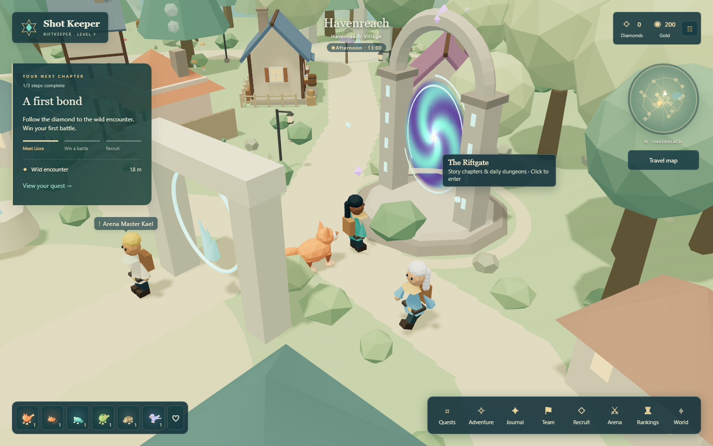
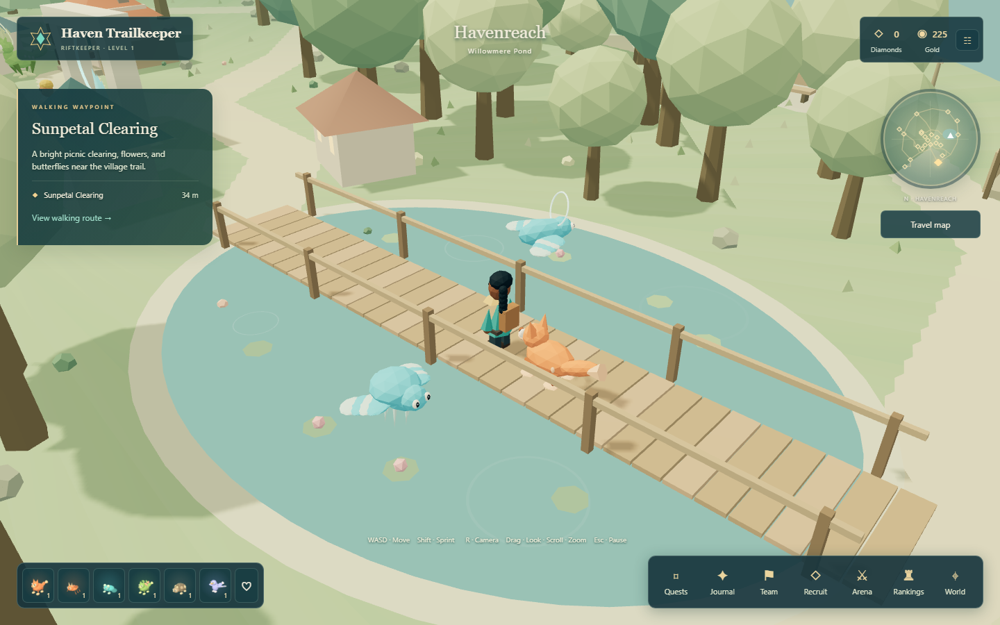

# Exploring Havenreach



Havenreach is the first place to learn the world at your own pace. Its village services remain together near the starting plaza, while a larger outer walking loop connects six quieter destinations.

| Place | What to find |
| --- | --- |
| Havenreach Village | Liora, the shrine, training, journal, arena, market, and garden |
| Sunseed Orchard | Fruit trees, flowers, Thornhare, Pebblit, and gathering |
| Oldleaf Grove | A shaded pine grove, Mossprig, and Briarhart |
| Waystone Ruins | Standing stones, a small crystal, Glimlet, and Pebblit |
| Cloudwatch Lookout | A viewing platform, telescope, resting bench, and bird Wildbound |
| Willowmere Pond | A wooden bridge, lily pads, ripples, and Tide creatures |
| Sunpetal Clearing | A picnic spot, wildflowers, butterflies, and little companions |

Open **Travel map**, select a destination, and set a walking waypoint. Follow the pale paths around obstacles. The pond crossing is marked on both the local map and minimap. Hold Shift to sprint, press R to restore the camera, or choose **Return to Havenreach village** in the pause menu.

There are nine daily Sunseed sites in Havenreach, including the original three. Gathering still grants one Sunseed and 25 Gold; the server remembers each pickup and resets availability on the UTC daily boundary. Other regions retain their original three nodes.



## A welcome on the porch

Click the ground to walk there. The route follows the trails around trees, homes, and water, and a gold marker shows where you are heading. Click a villager, house, creature, Sunseed crystal, cache, the dock, or a world label: your keeper walks within reach and then interacts. A click right beside a small crystal or cache still counts. Hover anything clickable to see a highlight ring and a tooltip. Keyboard movement cancels a walk at any time. A camera drag never activates anything. On touch screens, tap objects or the nearby action button. No instructions sit under the keeper on desktop; the pause menu has a **Controls** reference.

Six houses are marked on the map: Hearthcrumb Bakery, Maplewick Workshop, Sunpetal Glasshouse, Applebright Cottage, Cloudwatch Lodge, and Oldleaf Refuge. Set a route to any porch, read its welcome, and sign its visitor book once for 15 Gold and 10 XP for your keeper and active team. All six stamps award an extra 50 Diamonds. The stamps belong to your saved profile and cannot be collected twice. These are porch visits; house interiors are future work.

Click a roaming habitat Wildbound to read its field note and hear its species call. Ranger Tali still provides the existing wild-battle and bonding service.

## A village that feels lived in

Nine timber cottages, a windmill, a stone well, a campfire, and lamp posts now line the trails. Six islanders (Mira, Old Tomas, Juniper, Rowan, Ada, and Brother Elm) walk between the plaza, the market, the dock, the clearing, and their homes. Click one to say hello; their greetings hint at caches, fishing, the forge, and the Riftgate. They head home when night falls.

An island day lasts 18 real minutes. At dusk, windows, lanterns, and lamps glow; at night, moonlight, stars, and fireflies appear, and three warm lights brighten the plaza, market, and campfire. Turn the cycle off in **Sound & settings** to keep the afternoon light.

## Skyglass caches and fishing

Eight Skyglass caches are hidden away from the trails. Open **Travel map** to read a clue for each one you have not found. Look for a faint sparkle, then click the cache. Each cache gives a fixed reward once, and finding all eight adds 100 Diamonds.

Walk out onto the Willowmere dock and click it to fish. Cast, wait for a bite, then reel in (click or press Space) while the marker crosses the gold zone. You have eight casts per UTC day. Catches are Willow minnows (8 Gold), Glimmer carp (18 Gold), and rare Skyfin (45 Gold). Sell them at Pip's market.

## Extending the island

`packages/shared/haven.ts` owns destinations, routes, shoreline/bridge/dock rules, cottages, lamps, the Riftgate, caches, resource coordinates, forest placement, and wildlife habitat definitions. Every solid prop is an oriented collision box, and `packages/shared/pathfind.ts` plans click-to-walk routes over the same rules. The local map and world markers read those same coordinates. Existing NPC locations, creature IDs, save identifiers, and currency rules are retained.

The cottages, windmill, well, dock, and lamps are merged into a few vertex-colored meshes (`village-kit.ts`), so the larger village adds very few draw calls.

The woodland batches trees and ground cover into instanced meshes. Low graphics uses simpler crowns and less ground cover, while solid tree positions stay consistent. Nearby crowns make room for the camera, distant habitat creatures stop animating, and reduced motion suppresses wind, butterflies, and decorative water motion. This reduces avoidable work; it is not a universal frame-rate guarantee.

## Verification

```powershell
npx vitest run tests/haven.test.ts tests/town.test.ts
npx playwright test tests/browser/haven.spec.ts tests/browser/hud.spec.ts tests/browser/journey.spec.ts
npm run build
```

The layout tests sample every trail segment and destination, check the bridge/shoreline, verify resource eligibility, and keep trees away from the trail center. The browser route walks to the clearing, gathers a new resource, crosses the pond, visits the northern landmarks, and returns to the village. It also checks map selection, mobile layout, scenery presence, and a bounded draw-call count at the sampled scene. A second scenario clicks actual 3D villagers, resource crystals, and a house, signs a book, and checks persistence after reload. The tests use separate profiles and a test database.

New lands, extra creature tiers, and a redesigned mission/animation format are later additions. This expansion gives those future adventures a stronger starting place.
